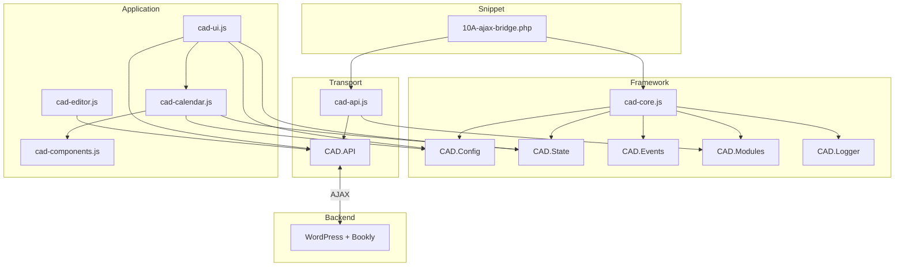

# CAD Scheduler

Modern Bookly frontend for multi-table studio scheduling.

## Design Principles

- Modular first
- No plugin modifications
- Code Snippets compatible
- Bookly remains the scheduling engine
- Modern JavaScript (ES6+)
- Fast and responsive
- Progressive enhancement
- Fully documented

## Structure

```
docs/           Project documentation
src/            Frontend modules
snippets/       WordPress / Bookly integration snippets
assets/         Static assets (css, images)
```

## Framework Principles

- **Core is framework-only** — `cad-core.js` provides infrastructure only; no HTTP, Bookly, or DOM code
- **Transport is separate** — all WordPress AJAX lives in `cad-api.js` as `CAD.API`
- **Controlled state** — configuration and runtime data flow through `CAD.Config` and `CAD.State`
- **Explicit modules** — features register via `CAD.Modules` and expose PascalCase shortcuts (e.g. `CAD.API`)
- **Enforced load order** — `cad-core.js` always loads first; see [Architecture](docs/architecture.md)

Full architectural detail lives in [docs/architecture.md](docs/architecture.md).

## Framework Overview

### Public Framework Modules

| Module | Responsibility |
|--------|----------------|
| `CAD.Config` | Application configuration via getter/setter API |
| `CAD.State` | Runtime state via getter/setter API |
| `CAD.Events` | Lightweight event bus (`on`, `off`, `emit`) |
| `CAD.Modules` | Module registration and lookup |
| `CAD.Logger` | Debug-aware logging (`log`, `warn`, `error`) |
| `CAD.API` | WordPress AJAX bridge (`request`, `getSchedule`) |

### Module Loading Order

```
1. cad-core.js
2. cad-api.js          (requires cad-core)
3. cad-components.js   (requires cad-core)
4. cad-editor.js       (requires cad-core, cad-api)
5. cad-calendar.js     (requires cad-core, cad-components)
6. cad-ui.js           (requires cad-core, cad-api, cad-calendar)
```

WordPress enqueue order is defined in `snippets/10A-ajax-bridge.php`.

### Module Interaction



## Application Modules

| File | Purpose |
|------|---------|
| `cad-core.js` | Framework foundation |
| `cad-api.js` | WordPress AJAX transport |
| `cad-ui.js` | UI orchestration and layout |
| `cad-components.js` | Reusable UI components |
| `cad-editor.js` | Schedule editor interactions |
| `cad-calendar.js` | Multi-table calendar view |

## Documentation

- [Architecture](docs/architecture.md)
- [Roadmap](docs/roadmap.md)
- [Changelog](docs/changelog.md)

## Snippets

WordPress snippets live in `snippets/`. Start with `10A-ajax-bridge.php` for the Bookly AJAX bridge.
