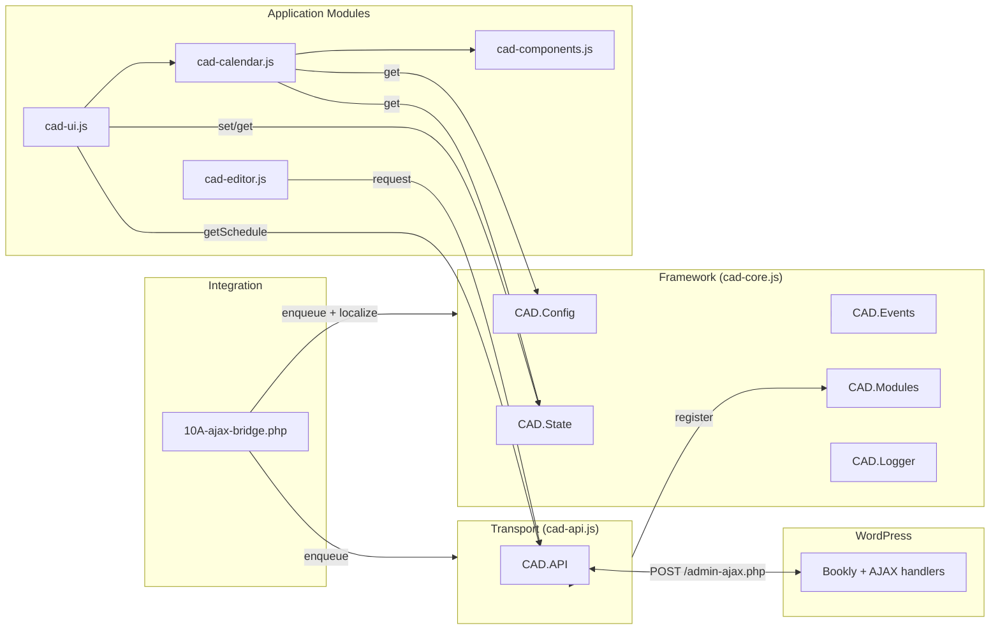

# Architecture

## Overview

CAD Scheduler replaces the default Bookly frontend with a custom multi-table studio scheduling interface. WordPress handles authentication and data persistence via Bookly; the frontend modules in `src/` render and manage the scheduling UI.

The codebase separates **framework** concerns (`cad-core.js`), **transport** concerns (`cad-api.js`), and **application** concerns (UI, calendar, editor, components).

## Framework Principles

- **Core is framework-only** — `cad-core.js` exposes the `CAD` namespace and infrastructure (config, state, events, modules, logging, lifecycle). It never performs HTTP requests, references Bookly, or touches the DOM.
- **Transport is separate** — all WordPress AJAX communication lives in `cad-api.js` and is exposed as `CAD.API`.
- **Controlled state** — reads and writes go through `CAD.Config` and `CAD.State` getter/setter APIs; objects and arrays are cloned on write.
- **Explicit modules** — features register via `CAD.Modules.register()` and may expose a PascalCase namespace shortcut (e.g. `CAD.API`).
- **Predictable lifecycle** — `CAD.init()` is idempotent; `CAD.destroy()` tears down listeners, state, modules, and framework shortcuts for clean reinitialization.
- **Enforced load order** — `cad-core.js` always loads first; transport and application modules declare script dependencies explicitly.

## Layers

```
WordPress + Bookly (backend)
        ↕
snippets/10A-ajax-bridge.php
        ↕
cad-core.js  →  CAD.Config / CAD.State / CAD.Events / CAD.Modules / CAD.Logger
        ↕
cad-api.js  →  CAD.API
        ↕
cad-ui.js · cad-calendar.js · cad-editor.js · cad-components.js
        ↕
assets/ (css, images)
```

## CAD Core

**File:** `src/cad-core.js`

### Public API

| Export | Purpose |
|--------|---------|
| `CAD.VERSION` | Semantic version and build identifier |
| `CAD.Config` | Configuration store (`get`, `set`, `has`, `getAll`, `merge`, `reset`) |
| `CAD.State` | Runtime state store (same method surface as `CAD.Config`) |
| `CAD.Events` | Event bus (`on`, `off`, `emit`) |
| `CAD.Modules` | Module registry (`register`, `get`, `has`, `unregister`, `names`) |
| `CAD.Logger` | Logging (`log`, `warn`, `error`) |
| `CAD.Utils` | Shared utilities (`clone`, `merge`, `isPlainObject`, …) |
| `CAD.ready()` | Queue callbacks until `CAD.init()` completes |
| `CAD.init()` | Initialize the framework with configuration options |
| `CAD.destroy()` | Tear down listeners, state, modules, and framework shortcuts |

## CAD.API

**File:** `src/cad-api.js`

Registered via `CAD.Modules.register('api', api)` and exposed as `CAD.API`.

| Method | Purpose |
|--------|---------|
| `CAD.API.request(action, data)` | Generic WordPress AJAX request |
| `CAD.API.getSchedule(date)` | Retrieve appointments for a given date |

Configuration keys consumed by CAD.API (set via `CAD.init()` or WordPress localization):

- `ajaxUrl` — WordPress AJAX endpoint
- `nonce` — CSRF nonce for authenticated requests

## Module Loading Order

Scripts must load in dependency order. WordPress enqueue definitions live in `snippets/10A-ajax-bridge.php`.

| Order | File | Dependencies |
|-------|------|--------------|
| 1 | `cad-core.js` | — |
| 2 | `cad-api.js` | `cad-core` |
| 3 | `cad-components.js` | `cad-core` |
| 4 | `cad-editor.js` | `cad-core`, `cad-api` |
| 5 | `cad-calendar.js` | `cad-core`, `cad-components` |
| 6 | `cad-ui.js` | `cad-core`, `cad-api`, `cad-calendar` |

`cad-api.js` must load before any module that calls `CAD.API` (`cad-editor.js`, `cad-ui.js`).

## Application Modules

| File | Purpose |
|------|---------|
| `cad-ui.js` | Top-level UI shell; loads schedule data via `CAD.API.getSchedule()` |
| `cad-components.js` | Shared UI primitives (tables, time slots, appointment blocks) |
| `cad-editor.js` | Inline editing; persists changes via `CAD.API.request()` |
| `cad-calendar.js` | Multi-table grid; reads `CAD.Config` and `CAD.State` |

## Module Interaction


